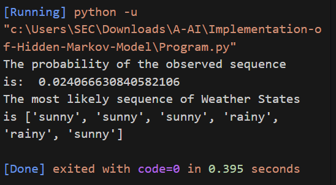

<H3>Name: Kavinraja D </H3>
<H3>Reg No: 212222240047</H3>
<H3>EX. NO.4</H3>
<H3>DATE: </H3>
<H1 ALIGN =CENTER> Implementation of Hidden Markov Model</H1>

## Aim:

Construct a Python code to find the sequence of hidden states by the known sequence of observances using Hidden Markov Model. Consider two hidden states Sunny and Rainy with observable states,happy and sad.

## Algorithm:

Step 1:Define the transition matrix, which specifies the probability of transitioning from one hidden state to another.<br>
Step 2:Define the emission matrix, which specifies the probability of observing each possible observation given each hidden state.<br>
Step 3:Define the initial probabilities, which specify the probability of starting in each possible hidden state.<br>
Step 4:Define the observed sequence, which is the sequence of observations need to be analyzed.<br>
Step 5:Initialize the alpha matrix with zeros, where each row represents a time step and each column represents a possible hidden state.<br>
Step 6:Calculate the first row of the alpha matrix by multiplying the initial probabilities by the emission probabilities for the first observation.<br>
Step 7:Loop through the rest of the observed sequence and calculate the rest of the alpha matrix by multiplying the emission probabilities by the sum of the product of
the previous row of the alpha matrix and the corresponding row of the transition matrix.<br>
Step 8:Calculate the probability of the observed sequence by summing the last row of the alpha matrix.<br>
Step 9:Find the most likely sequence of hidden states by selecting the hidden state with the highest probability at each time step based on the alpha matrix.<br>

## Program:

```py
import numpy as np
transition_matrix = np.array([[0.7, 0.3],[0.4, 0.6]])
emission_matrix = np.array([[0.1, 0.9],[0.8,0.2]])
initial_prob = np.array([0.5, 0.5])
obs_seq = np.array([1,1,1,0,0,1])
alpha = np.zeros((len(obs_seq),len(initial_prob)))
alpha[0, :] = initial_prob * emission_matrix[:, obs_seq[0]]
for t in range(1, len(obs_seq)):
    for j in range(len(initial_prob)):

        alpha[t, j] = emission_matrix[j,
        obs_seq[t]]*np.sum(alpha[t-1,:] *
        transition_matrix[:, j])
probability = np.sum(alpha[-1, :])
print("The prob of observed seq is:", probability)
most_likely = []
for t in range(len(obs_seq)):
    if alpha[t, 0] > alpha[t,1]:
        most_likely.append("sunny")
    else:
        most_likely.append("rainy")
```

## Output:




## Result:

Thus Hidden Markov Model is implemented using python.
